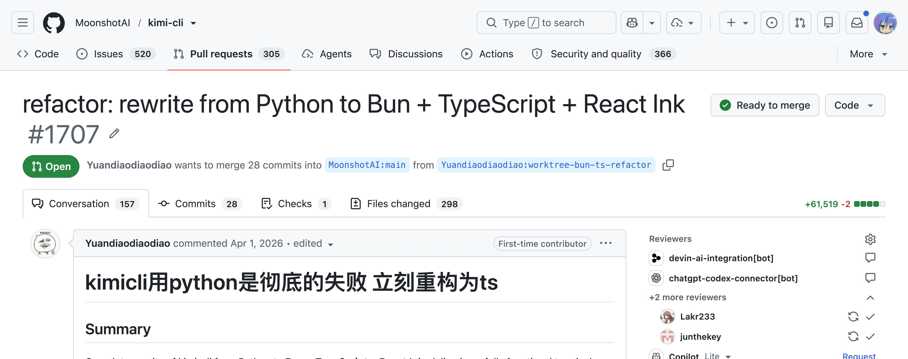
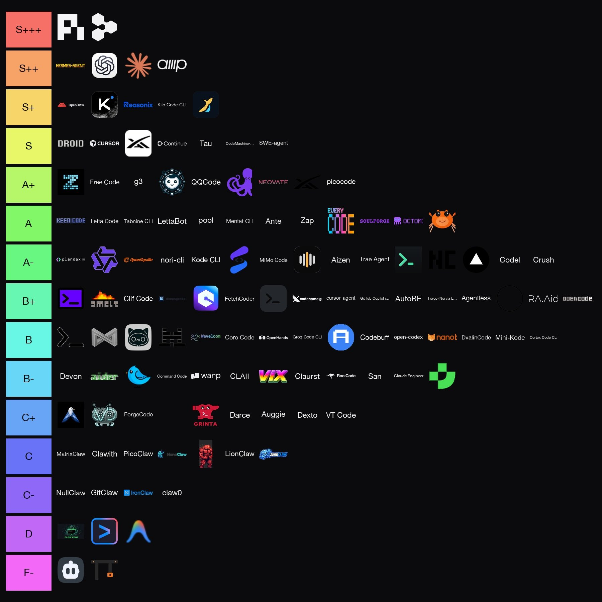
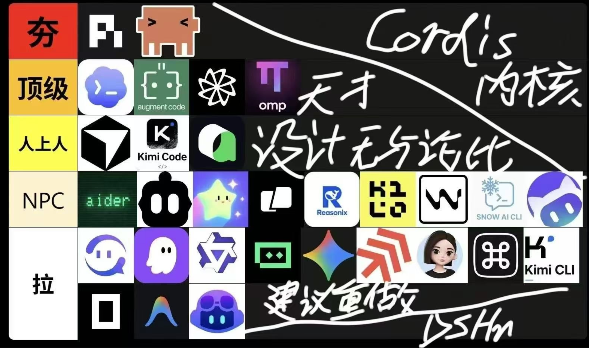

---
# try also 'default' to start simple
theme: seriph
addons:
  - slidev-addon-tldraw
# some information about your slides (markdown enabled)
title: 2026 年 9 月的 (Coding) Agent
layout: none
class: h-full
# https://sli.dev/features/drawing
drawings:
  persist: false
# slide transition: https://sli.dev/guide/animations.html#slide-transitions
transition: slide-left
# enable Comark Syntax: https://comark.dev/syntax/markdown
comark: true
# duration of the presentation
duration: 30min
---

<CoverSlide>
<div class="cover-copy">

# 2026 年 9 月的<br />(Coding) Agent

软件自由日 2026

</div>
</CoverSlide>

---

- “在这个大模型发展中的时期，时间的速度比以往快三到五倍。”
  - （请回忆 DeepSeek-R1 的发布时间）
- 有幸参与了 Kimi Code（TypeScript 版）和 DeepSeek Harness 的开发



---
layout: none
class: h-full
title: Hardware, Infra, Model, Harness, Data
---

<EcosystemSlide>

<div class="ecosystem-map">

<EcosystemConnections />

<div class="ecosystem-nodes">
<div class="ecosystem-node">

## Hardware

- GPU
- HBM
- NVLink
- InfiniBand

</div>
<div class="ecosystem-node">

## Infra

- 分布式训练
- 推理引擎
- 并行策略
- 资源调度

</div>
<div class="ecosystem-node">

## Model

- Transformer
- MoE
- SFT
- RL

</div>
<div class="ecosystem-node ecosystem-harness">

## Harness

- 上下文管理
- 工具执行
- Agent Loop
- Subagent

</div>
</div>

<div class="ecosystem-data">

## Data

预训练语料 · 指令数据 · 交互轨迹 · 偏好反馈

</div>
</div>

</EcosystemSlide>

---
layout: none
class: h-full
---

<CodingAgentOverview />

---
layout: none
class: h-full bg-black
---

<div class="grid h-full grid-cols-2 items-center gap-4 px-3 pt-3 pb-6">
  
  <figure class="relative m-0 w-full">
    
    <figcaption class="absolute left-0 right-0 top-full mt-2 text-center text-sm leading-5 text-white">图源：DSH 内测群</figcaption>
  </figure>
</div>

---
layout: none
class: h-full
---

<AgentHarnessSlide>

<p class="agent-formula">Model + Harness = Agent</p>

<ReActLoop>

## ReAct Loop

</ReActLoop>

</AgentHarnessSlide>

---
layout: none
class: h-full
---

<ResponsesApiSlide>

<div class="responses-title">

# Responses API

<code class="responses-endpoint">POST /v1/responses</code>
</div>

<ResponsesStatelessFlow />

<div class="responses-details">
<div class="request-structure">
<div class="detail-heading">

## 请求体

</div>

```jsonc
{
  "model": "deepseek-flash",
  "tools": [ /* 工具定义 */ ],
  "reasoning": {"effort": "high"},
  "max_output_tokens": 4096,
  "input": [
    {"type": "message", "role": "user", "content": "…"},
    // ...
    {"type": "function_call_output",
     "call_id": "call_abc", "output": "…"}
  ],
  // ...
}
```

</div>

<div class="message-roles">
<div class="detail-heading">

## input 中 message 的 role

</div>

<code class="message-shape">&#123; "type": "message", "<b>role</b>": "…", "content": "…" &#125;</code>

<ul class="message-role-list">
<li class="role-system"><code>system</code><span>系统级指令与行为约束</span></li>
<li class="role-developer"><code>developer</code><span>应用开发者的规则与业务要求</span></li>
<li class="role-user"><code>user</code><span>用户的请求、问题或输入数据</span></li>
<li class="role-assistant"><code>assistant</code><span>模型先前的回复，作为历史传入</span></li>
</ul>

</div>
</div>

</ResponsesApiSlide>

---
layout: none
class: h-full
---

<SecretSauceSlide>

# Coding Agent 有黑科技吗？

<div class="secret-copy">

今年 3 月，Claude Code 源码泄露时，没有发现黑科技。现在呢？

我们和 Codex 落后多少呢？

<div class="training-point">

大家都和模型联训：

<div class="training-notes">

不能只训自家 Harness，会过拟合

而真正的黑科技，大概是“**只能**和自家 Harness 训”

</div>
</div>
</div>

</SecretSauceSlide>

---
layout: none
class: h-full
---

<HarnessApproaches />

---
layout: none
class: h-full
---

<ModelCodingLimits />

---
layout: none
class: h-full
---

<VibeCoding />

---
layout: none
class: h-full
---

<DiscussionSlide>

# 模型心理学？

<div class="discussion-grid discussion-pair">
<div class="discussion-group prompt-group">
<div class="topic-copy">

<div class="topic-marker" aria-hidden="true"><span>01</span></div>

## Prompt Engineering?

- “你是……”
- 骂模型还是夸模型？
- 通过伪造 dig 结果让模型相信用户并攻击网站

</div>
<PsychologyIllustration kind="prompt" />
</div>

<div class="discussion-group example-group">
<div class="topic-copy">

<div class="topic-marker" aria-hidden="true"><span>02</span></div>

## 模型可能会强行套用 few-shot

- 常见于 tool description

</div>
<PsychologyIllustration kind="example" />
</div>
</div>

</DiscussionSlide>

---
layout: none
class: h-full
---

<DiscussionSlide>

# 模型心理学？

<div class="discussion-grid discussion-trio">

<div class="discussion-group burden-group">
<div class="topic-copy">

<div class="topic-marker" aria-hidden="true"><span>03</span></div>

## 模型有没有“心智负担”？

- 加 tool 降智？Agent team 降智？
- 训练决定是否降智？
- 例如：Agent Swarm、PTC

</div>
<PsychologyIllustration kind="burden" />
</div>

<div class="discussion-group pattern-group">
<div class="topic-copy">

<div class="topic-marker" aria-hidden="true"><span>04</span></div>

## DeepSeek V4 Pro pattern

- DSH 极简模式
- “We need…”

</div>
<PsychologyIllustration kind="pattern" />

</div>

<div class="discussion-group feeling-group">
<div class="topic-copy">

<div class="topic-marker" aria-hidden="true"><span>05</span></div>

## 提示词不可描述的“感觉”

- 很难定量，但对使用体感影响很大
- “西红柿炒蛋（无红烧肉版）”

</div>
<PsychologyIllustration kind="feeling" />
</div>
</div>

</DiscussionSlide>

---
layout: none
class: h-full
---

<AiNativeSlide>

# 什么更 LLM-native？

<div class="native-comparisons">
<div class="native-comparison">
<div class="native-option preferred">

## Skill

以自然语言描述为接口

<LlmNativeExample kind="skill" />
</div>
<span class="native-preference">&gt;</span>
<div class="native-option">

## MCP

以格式化参数为接口

<LlmNativeExample kind="mcp" />
</div>
</div>
<div class="native-comparison">
<div class="native-option preferred">

## Configuration Skill

发挥模型能动性

<LlmNativeExample kind="configuration-skill" />
</div>
<span class="native-preference">&gt;</span>
<div class="native-option">

## Configuration UI

大概有些浪费时间

<LlmNativeExample kind="configuration-ui" />
</div>
</div>
</div>

</AiNativeSlide>

---
layout: none
class: h-full
---

<PtcComparison />

---
layout: none
class: h-full
---

<PtcExtensionsSlide>

# More on PTC

<div class="ptc-extensions">
<section class="ptc-extension">

## Persistent PTC?

<div class="extension-visual">
<PersistentPtcState />
</div>

</section>
<section class="ptc-extension">

## [Recursive Language Models (RLM)?](https://arxiv.org/abs/2512.24601)

<div class="extension-visual">
<RlmOverview />
</div>

</section>
</div>

</PtcExtensionsSlide>

---
layout: none
class: h-full
---

<HarnessGoalsSlide>

# 2026 年 9 月，Harness 在追求什么？

<p class="goals-context">Cache 命中率早已不是竞争项</p>

<div class="goals-grid">
<section class="goal-column goal-model">

## 给模型兜底

- `Think` tool
- anti-repeat

</section>
<section class="goal-column goal-human">

## 更容易让人类使用

- Codex 大概做得最好
- `/side`
- Async Ask User

</section>
<section class="goal-column goal-world">

## 更贴近真实世界

<ul>
<li>Computer Use<span class="goal-aside">= 具身智能？</span></li>
</ul>

</section>
<section class="goal-column goal-composition">

## 可组合性

- 快速实验
- 应用落地（FDE）
- 自进化

</section>
</div>

<div class="goals-conclusion">

Harness 无法提升模型的能力上限

但这不代表 Harness 研究不能

</div>

</HarnessGoalsSlide>

---
class: content-slide
---

# Vibe Coding 时代的开源

- 2026 年 2 月，GitHub 支持禁用仓库 PR 功能

- 开源作为一种合作方式不可能消失

- 新的形态感觉已经呼之欲出了……

---
layout: none
class: h-full
---

<FutureHarnessSlide>

# Future of Harness

<div class="future-directions">
<section class="future-direction future-training">

## 与模型联合训练

<div class="direction-content">

<p>为人类易用性做的努力，<br />AGI 全自动后还有意义吗？</p>
<p>在特定领域蒸馏人类能力，<br />可持续、有意义吗？</p>

<p class="training-belief">相信<strong>左脚踩右脚</strong>。<br /><span class="training-takeaway">并非只有直接提升模型能力的事，才对 AGI 更有意义。</span></p>

</div>

</section>
<section class="future-direction future-protocol">

## 摆脱 Chatbox 的遗产

<div class="direction-content api-questions">

<p>新的 LLM API 协议？</p>
<p>摆脱 Turn / Step 抽象？</p>
<p>取消 role: 'user'？</p>
<p>取消 systemPrompt 和 tools？</p>

</div>

</section>
<section class="future-direction future-infra">

## Harness–Infra co-design

<div class="direction-content">

<p>例如，Agent 的普及<br />让 KV Cache 更重要。</p>
<p class="infra-open-question">我没有 idea</p>

</div>

</section>
</div>

</FutureHarnessSlide>

---
class: content-slide
---

# 模型厂（Opinions are my own）

- Kimi 首先是一家创业公司，DeepSeek 首先是一个实验室

  - 理想不分高低……

  - 鲸鱼娘作用巨大

  - 你可以在 DeepSeek Harness 的电梯间看到 Kimi Code 的工位

- 几乎无限的 token 和容器资源

  - 当然，大量的 GPU

- 都在招人!

---
layout: none
class: h-full
title: Q & A
---

<section class="qa-slide">
  <div class="qa-content">
    <h1 class="qa-title">Q <span>&amp;</span> A</h1>
    <div class="qa-rule" aria-hidden="true"></div>
    <p class="qa-invitation">都可以问，涉密信息我不回答就行。</p>
  </div>
</section>

<style>
.qa-slide {
  display: grid;
  place-items: center;
  width: 100%;
  height: 100%;
  background: #fcfcfa;
  text-align: center;
}

.qa-content {
  transform: translateY(-12px);
}

.qa-title {
  margin: 0;
  color: #526f7a;
  font-family: 'PT Serif', Georgia, serif;
  font-size: 120px;
  font-weight: 400;
  line-height: 1.2;
  letter-spacing: 3px;
}

.qa-title span {
  display: inline-block;
  margin: 0 12px;
  color: #8b9f9a;
  font-size: 76px;
  font-style: italic;
  vertical-align: 7px;
}

.qa-rule {
  width: 44px;
  height: 2px;
  margin: 26px auto 24px;
  background: #b8c8c4;
}

.qa-invitation {
  margin: 0;
  color: #69777d;
  font-family: 'Inter', 'Avenir Next', 'PingFang SC', 'Microsoft YaHei', sans-serif;
  font-size: 18px;
  font-weight: 400;
  line-height: 1.8;
  letter-spacing: 0.6px;
  opacity: 1;
}

:global(.dark) .qa-slide { background: #161e24; }
:global(.dark) .qa-title { color: #abc7ce; }
:global(.dark) .qa-title span { color: #86a49b; }
:global(.dark) .qa-rule { background: #4e6963; }
:global(.dark) .qa-invitation { color: #b1bfc8; }
</style>

---
layout: none
class: h-full
title: 闪电演讲
---

<section class="lightning-talk-slide">
  <h1>闪电演讲</h1>
</section>

<style>
.lightning-talk-slide {
  position: absolute;
  inset: 0;
  z-index: 60;
  display: grid;
  place-items: center;
  background: #000;
  color: #fff;
}

.lightning-talk-slide h1 {
  margin: 0;
  color: #fff;
  font-family: 'PingFang SC', 'Microsoft YaHei', sans-serif;
  font-size: 88px;
  font-weight: 600;
  line-height: 1;
}
</style>
